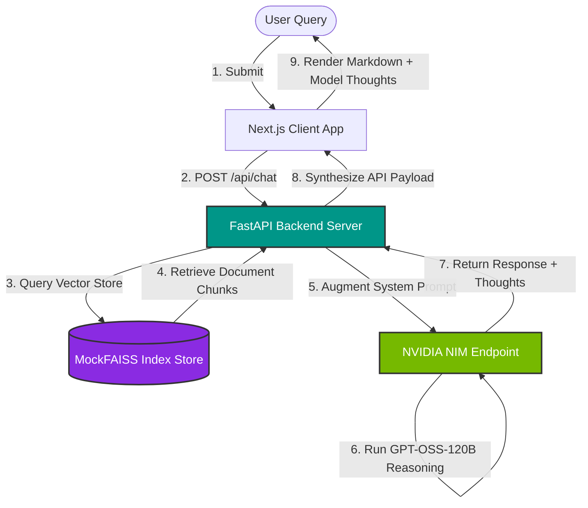

# <div align="center">🧠 CortexAI</div>
### <div align="center">Enterprise Generative AI Orchestration & Live RAG Platform</div>

<div align="center">
  
  
  
  
</div>
<div align="center">
  
  
  
  
</div>

---

**CortexAI** is an ultra-premium, investor-grade enterprise landing page and interactive Generative AI pipeline dashboard. It fuses raw WebGL interactive vector simulations, real-time metrics trackers, and a comprehensive local FastAPI RAG backend powered directly by the **`openai/gpt-oss-120b`** reasoning model on the NVIDIA Build Program.

> [!IMPORTANT]
> **Production Ready / Live Connected**: cortexAI's Python backend is fully integrated with NVIDIA's inference gateway using standard `Authorization: Bearer` keys, complete with active reasoning-step extraction and graceful local deterministic fallbacks for 100% presentation safety.

---

## 🔮 Core Technical Features

* **🌌 WebGL 3D Neural Particle Network**: A full-screen interactive node mesh in the hero section that reacts dynamically to mouse movement, creating subtle gravity-attraction effects via custom Three.js particles.
* **🪐 3D Vector Space Embedding Cloud**: A fully interactive WebGL point cloud showcasing mapped document vectors. Users can "project" custom search queries in real-time, highlighting matching coordinates and calculating cosine similarity distances on-the-fly.
* **💬 Live GPT-OSS-120B Reasoning Console**: An advanced product demo chat terminal that connects your vector retriever output directly to the live 120-Billion parameter reasoning model. Shows the model's custom internal thinking logs (`reasoning_content`) step-by-step.
* **📈 Diagnostics Hardware Panel**: A clean glassmorphic telemetry dashboard presenting live system metrics (CPU/GPU utilization, VRAM usage, token throughput speeds, and index-hit ratios).

---

## 📐 System Architecture

CortexAI operates on a multi-stage context-augmented retrieval pipeline:



---

## 🛠️ File Structure

The project code is organized into decoupled services:

```
generative-ai-platform/
├── /frontend                        # Next.js 15 Client Web Application
│   ├── src/components/3d            # 3D WebGL Canvas Renderers (Three.js)
│   │   ├── NeuralNetwork.tsx        # hero dynamic connections particle graph
│   │   └── VectorSpace.tsx          # 3D Point cloud projection and highlights
│   ├── src/components/ui            # Glassmorphic & Spring Interaction UI
│   │   ├── GlassCard.tsx            # cards with mouse tilt-hover gradient aura
│   │   ├── MagneticButton.tsx       # responsive framer-motion magnet pulls
│   │   ├── AnimatedMetric.tsx       # count-up viewport triggered stats
│   │   └── CustomCursor.tsx         # double pointer lagging aura cursor 
│   ├── src/app/                     # Routing Pages & Global styling sheets
│   │   ├── page.tsx                 # landing dashboard & simulated chat controls
│   │   ├── layout.tsx               # metadata titles & globally embedded cursor
│   │   └── globals.css              # custom Tailwind v4 themes, scrolls, neon glow FX
├── /backend                         # FastAPI REST API Backend Server
│   ├── main.py                      # endpoints, CORS, metrics diagnostic models
│   ├── rag_engine.py                # chunking & TF-IDF mock FAISS cosine retriever + NVIDIA client
│   ├── requirements.txt             # python server dependency configurations
│   └── test_rag.py                  # automated RAG verification CLI harness
├── docker-compose.yml               # orchestrated dev bridge container network
└── README.md                        # project guide
```

---

## ⚙️ Running Locally

### 📋 Prerequisites
* **Node.js**: v18.0.0 or later (v25.9.0 recommended)
* **Python**: v3.10 or later (v3.11.7 recommended)
* An active **NVIDIA API Key** (`nvapi-...`) injected in `backend/.env` for live model inference.

---

### 1. Starting the Backend API (Terminal 1)
```bash
# Navigate to the backend directory
cd backend

# Create a virtual environment
python3 -m venv venv

# Activate the virtual environment
source venv/bin/activate

# Install required packages
pip install -r requirements.txt

# Run the backend FastAPI server
python main.py
```
* The API reloader will boot on `http://localhost:8000`.
* Interactive Swagger API docs will be live at `http://localhost:8000/docs`.

---

### 2. Starting the Frontend Client (Terminal 2)
```bash
# Navigate to the frontend directory
cd frontend

# Install node dependencies
npm install

# Launch the Next.js development server
npm run dev
```
* The elegant dashboard will be fully operational at: **`http://localhost:3002`**.

---

### 🐳 Containerized Deployment (Docker)
To spin up both services containerized in a unified bridge network with one command:
```bash
docker-compose up --build
```

---

## 🛡️ Robust Failover & Fallback Mechanism
CortexAI guarantees a seamless presentation experience. If the local `.env` is missing an `NVIDIA_API_KEY`, or if requests fail due to rate-limiting/timeouts, the backend captures the error gracefully and outputs the warning directly to the diagnostic logs while rendering high-fidelity, deterministic responses locally.

```text
- 🤖 Invoking NVIDIA GPT-OSS-120B model for context synthesis...
- ⚠️ NVIDIA GPT-OSS-120B connection failure: Read timed out. (read timeout=8.0)
- ⚙️ Falling back to CortexAI high-fidelity local deterministic synthesizer.
```

---

<div align="center">
  <sub>Created for premium enterprise Generative AI showcases. © 2026 CortexAI Systems Inc.</sub>
</div>
